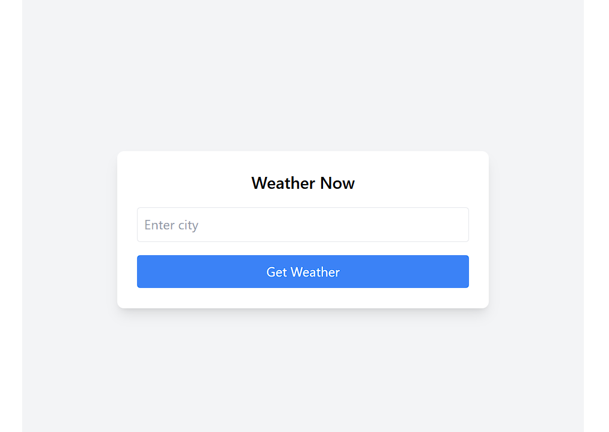
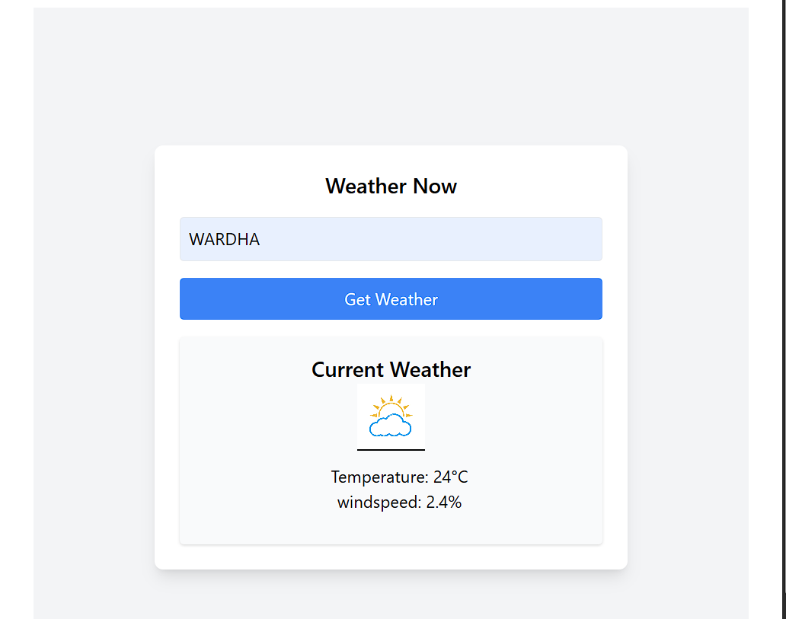

# Weather Now

**Weather Now** is a web application that allows users to quickly check current weather conditions for any city. Built for outdoor enthusiasts like Jamie, this app provides up-to-date weather information, using the [Open-Meteo API](https://open-meteo.com/).

## Features
- **Current Weather**: View current weather details for any city.
- **Search by City**: Simply enter a city name to see the weather information.
- **Responsive Design**: Optimized for desktop and mobile views.

## Screenshots and url
priview 
https://stackblitz.com/github/ganesh29082002/Weather-Aganitha-?file=README.md

Here are some screenshots of the UI:

### Home Screen


### Weather Search


## Getting Started

### Prerequisites
- Node.js and npm installed
- [Vite](https://vitejs.dev/) setup for a faster development experience

### Setup Instructions

1. **Clone the repository**:
   ```bash
   git clone https://github.com/your-username/weather-now.git
   cd weather-now
   npm install
   npm run dev
